```mermaid
flowchart TD
    A[(Chicago Data Portal)] --> B[🧹 Data Cleaning<br>Format, filter, normalize]
    B --> C[📤 Store in HDFS<br>Upload cleaned CSV]

    %% Section 1: Hadoop MapReduce
    C --> D1[🧮 Count Complaints per Year<br>Detect volume trend over time]
    C --> D2[🧮 Identify Top Complaint Types<br>Find most reported issues]
    C --> D4[🧮 Classify Resolved/Unresolved<br>Evaluate service responsiveness]
    C --> D7[🧮 Track Complaint Type Trends<br>Type-wise yearly evolution]

    %% Section 2: Apache Spark Jobs (In-memory)
    C --> E1[⚡ Fast Yearly Aggregation<br>Reimplementation of Job 1]
    C --> E2[⚡ Fast Top Types Analysis<br>Reimplementation of Job 2]
    C --> E4[⚡ Fast Resolution Analysis<br>Reimplementation of Job 4]
    C --> E7[⚡ Fast Complaint Trend Analysis<br>Reimplementation of Job 7]

    %% Section 3: HBase Insert
    E1 --> F1[🗃️ Insert Yearly Counts<br>RowKey: year#YYYY]
    E2 --> F2[🗃️ Insert Complaint Types<br>RowKey: type#name]
    E4 --> F4[🗃️ Insert Status Breakdown<br>RowKey: status#Resolved/Unresolved]
    E7 --> F7[🗃️ Insert Yearly Type Trends<br>RowKey: trend#year#type]

    %% Section 3b: Visualization
    F1 --> G[📊 Chart Generator<br>Java CLI using JFreeChart]
    F2 --> G
    F4 --> G
    F7 --> G
```

# 📊 Environmental Complaint Analysis – Big Data Project

This project analyzes environmental complaint data from the City of Chicago using a full big data stack: **Hadoop**, **Apache Spark**, and **HBase**. The goal is to perform distributed data processing, store aggregated outputs in HBase, and generate visual insights using Java-based charting tools.

---

## 📁 Dataset

- **Source**: [Chicago Data Portal – CDPH Environmental Complaints](https://data.cityofchicago.org/Environment-Sustainable-Development/CDPH-Environmental-Complaints/fypr-ksnz)
- **Format**: CSV
- **Size**: ~100,000+ rows of complaint records (complaint type, date, resolution status, etc.)
- **Fields used**:
  - `Complaint Type`
  - `Complaint Date`
  - `Resolved Date`
  - `Resolution`

---

## 🛠️ Technologies Used

| Layer | Tools |
|-------|-------|
| Storage | Hadoop HDFS |
| Processing | Hadoop MapReduce, Apache Spark (Java) |
| NoSQL Database | HBase 2.5.8 |
| Visualization | JFreeChart, Java 8 |
| Containerization | Docker (multi-node cluster setup) |
| Build Tool | Maven |

---

## 🔂 Processing Pipeline

### 📌 Section 1: Hadoop MapReduce Jobs

- **Job 1**: Count complaints per year  
- **Job 2**: Top complaint types  
- **Job 4**: Resolved vs Unresolved counts  
- **Job 5**: Average resolution time  
- **Job 7**: Complaint type trends over time  

### ⚡ Section 2: Spark Jobs (Java RDD API)

- Reimplemented Jobs 1, 2, 4, and 7 using Apache Spark for in-memory parallel processing.

### 🗃️ Section 3: HBase Integration + Charting

- Insert Spark job outputs into HBase (`cdph_complaints` table)
- Generate:
  - Bar chart – Top complaint types
  - Line chart – Complaints per year
  - Pie chart – Resolution status
  - Area chart – Complaint type trends over time

---



---

## 🖼️ Sample Charts

| Chart | Description |
|-------|-------------|
| `TopComplaintTypes.png` | Most frequent environmental complaint categories |
| `ComplaintsPerYear.png` | Trends of complaints submitted each year |
| `ResolvedVsUnresolved.png` | Ratio of resolved to unresolved complaints |
| `ComplaintTrends.png` | Yearly trends by complaint type |

---

## ▶️ Running the Project

### 1. **Build the Project**
```bash
mvn clean package
```

### 2. **Run Insert + Charts from HBase**
```bash
docker cp target/env-project.jar hadoop-master:/root/
docker exec -it hadoop-master bash
java -cp env-project.jar hbase.visuals.HBaseChartsMenu
```

> Choose chart type from the CLI menu. PNGs will be saved to `/root/`.

---

## ✅ Prerequisites

- Java 8+
- Maven
- Docker or real Hadoop + HBase cluster
- HBase table: `cdph_complaints` with families: `details`, `status`, `location`

---

## 📌 Notes

- HBase errors like `NoSuchColumnFamilyException` may appear if the table is misconfigured. Ensure proper table creation before insert.
- All Spark and MapReduce jobs were tested locally before running on the cluster.
- Charts are built using `JFreeChart`, saved as `.png` files.
